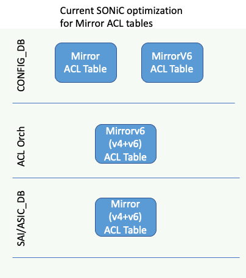
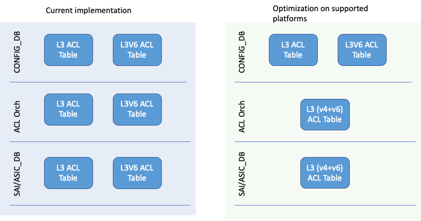
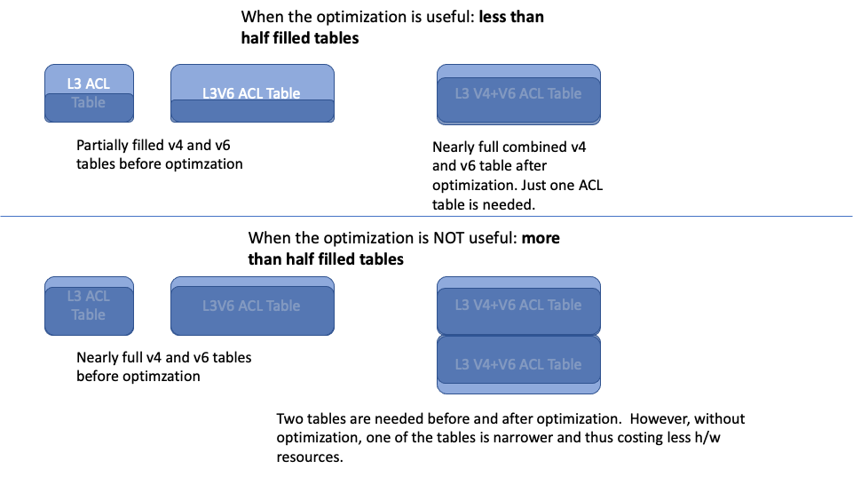
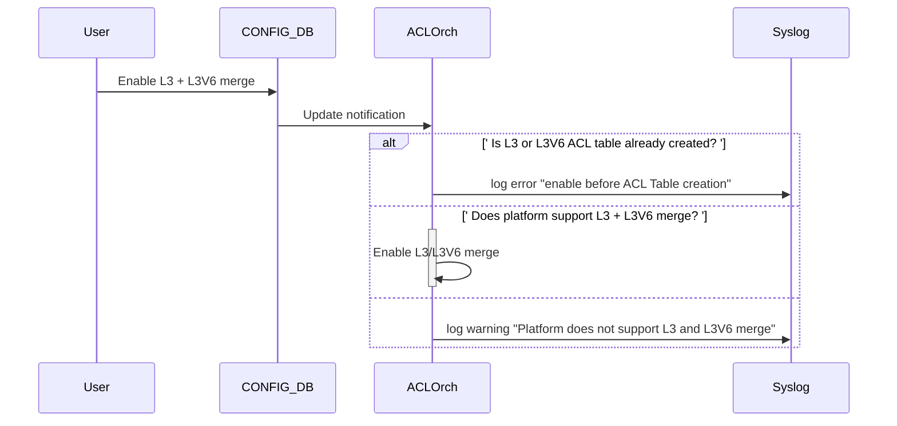
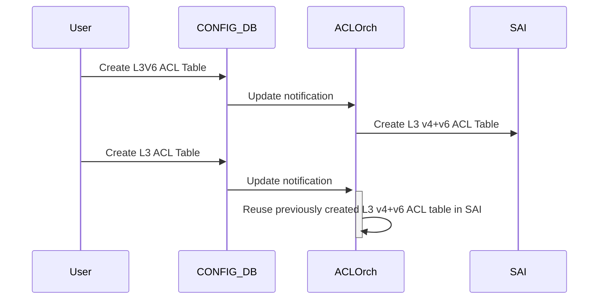

# Combine L3 ACL and L3V6 ACLs

## Introduction to L3 and L3V6 ACL Table Types
SONiC supports different in-built ACL Table types. These ACL table types have pre-defined set of ACL match-fields, ACL actions and bind points. 

L3 and L3V6 are such in-built ACL Table types. These ACL tables support packet actions like drop, redirect etc. L3 ACL Table type supports matching IPv4 fields like Source IPv4 address, Destination IPv4 address etc. Similarly, L3V6 ACL Table type supports matching IPv6 fields like Source IPv6 address, Destination IPv6 address etc.

##Problem overview
Currently SONiC creates separate SAI ACL tables for L3 and L3V6 ACLs. In some ASICs, if a user wants both v4 and v6 rules, they would end up using two hardware ACL tables instead of one. This is sub-optimal in ASICs where both v4 and v6 ACLs can be supported using the same hardware ACL table.
 
The proposal is to give the operator an ability to configure  L3 and L3V6 ACLs in the same hardware ACL Table wherever the underlying platform supports it. The proposed solution supports this optimization __without__ the operator having to change their existing ACL configuration in CONFIG_DB.
 
A similar approach has been taken in the community for Mirror ACL tables earlier. This proposal extends this solution to L3 ACLs.


## Table of Contents 

### Revision  

| Rev | Date     | Author          | Change Description |
|:---:|:--------:|:---------------:|--------------------|
| 0.1 | 14/Feb/23 | Ravindranath (**Marvell**)   | Initial Version.  |

### Scope  


This document provides the high level design in SONiC to combine L3 and L3V6 ACL tables in SAI on supported hardware.

### Definitions


| SONiC ACL Table Type     | Definition |
|:---------------:|--------------------|
| __L3__ ACL table type | A built-in ACL table type in SONiC that can match __IPv4__ fields along with incoming port and support ACL redirect and packet ACL actions|
| __L3V6__ ACL  table type | A built-in ACL table type in SONiC that can match __IPv6__ fields along with incoming port  and support redirect and packet ACL actions|
| __Mirror__ ACL  table type | A built-in ACL table type in SONiC that can match __IPv4__ fields and supports __Mirror__ ACL action |
| __MirrorV6__ ACL  table type | A built-in ACL table type in SONiC that can match __IPv6__ fields and supports __Mirror__ ACL action |
| __Custom__ ACL  table types | A recent enhancement where one or more ACL table types can be created by the user specifying the match-field list, action-list and the bindpoint-types list|


### Overview 

This document describes the orchagent support by which user created L3 ACL table and L3V6 ACL tables are combined into a single SAI/ASIC ACL table on platforms supporting this feature.
The proposed changes are similar to what is currently being done for Mirror ACL and MirrorV6 ACLs.

### Requirements

1. Support user L3ACL and L3V6 ACL tables with a single underlying SAI ACL table.
   * This will be enabled only on platforms needing this optimization.
2. The operator must NOT have to change their existing ACL configuration to use this optimization.
3. Provide a configurable option for the operator to disable this feature.


### Architecture Design 

 ACL Orchagent is enhanced to achieve these requirements. This design is largely similar to the existing optimization done in SONiC for Mirror ACL tables. There are no architecture changes to current SONiC.

#### Brief overview of the _existing_ optimization for Mirror ACL table

Today, Orchagent has a static compile time check to determine platforms that support v4 and v6 Mirror ACL rules in the same ACL table. On these platforms, when user creates a Mirror v4 (or a Mirror v6) ACL table in the CONFIG_DB, orchagent creates a single SAI ACL Table that has both v4 and v6 match fields. Later, when the user creates another Mirror v6 (or a Mirror v4) ACL table with the same ACL direction in CONFIG_DB, orchagent reuses the previously created SAI ACL table.

The below diagram illustrates the behavior of the optimization in supported platforms when both these ACL tables are created in the same ACL direction, say ingress. 
The user sees two different ACL tables irrespective of the platform. Orchagent, internally enables the optimization based on the platform and this is transparent to the end user. 

<p align=center>

</p>

Note: In the above case, the requirement is that both the ACL tables are bound to the same set of ports/LAG.

#### Combining L3 and L3V6 
The below picture illustrates the optimization being done for L3/L3V6 ACLs. The picture on the left shows the current L3 and L3V6 ACL table implementation in SONiC. The picture on the right shows the optimization on supported platforms.

<p align=center>

</p>

An important aspect of this design is that the underlying platform optimizations are transparent to the operator: _the operator uses the same ACL configuration on all platforms_.

#### Design choices
##### Config to enable/disable optimization

Today, the Mirror v4 and v6 ACL tables are combined based on platform specific checks done at compile time.  These are done using platform names since SAI does not have a mechanism to detect the ASIC capability to combine tables.

The flip side of these platform checks is that the platform vendor has only two choices: either always combine or never combine. There is no mechanism to configure this based on the deployments/customers. In some deployments, when the operator has no v6 rules, we would need the optimization disabled, where as in other deployments with v6 the optimization needs to be enabled.

Also there are cases when the number of v4 and v6 rules are large enough to fill two ASIC ACL tables as shown in the picture below. In this case, it would be more efficient to use a narrow ACL table for v4 and a wider ACL table for v6.


<p align=center>

</p>
In the case of warm upgrades, we would need the optimization be disabled if the ACL tables are already created in a software version that does not have this optimization.


Hence, we will provide support for the operator to enable/disable this feature on top of the platform specific checks. This is the only difference of this feature when compared to current Mirror ACL table merge feature in SONiC.

We will do this via  a configurable (CONFIG_DB) option to enable/disable this feature.


##### Why not use Custom ACL Tables?
Recently, support was added in SONiC to let the operator create custom ACL table types. Here, the user can specify the types of match-fields, actions and bindpoints. This can be used by the operator to define a single ACL table with both v4 and v6 match fields and support packet actions like drop and redirect.

However the problems with this approach are:
- The operator has to migrate their existing ACL table configurations to use the custom ACL table type instead of the pre-built L3 and L3V6 ACL Table type.
- The operator has to maintain separate ACL table configurations based on whether the underlying platform supports a single ACL table or not.

### High-Level Design 

This section covers the high level design of the feature.
The below sequence diagram shows the operations that happen on supported platforms.


#### Support to configure ACL table combining

There are two conditions to enable the optimization:

1. There will be compile time platform checks to determine whether the platform supports merging L3 and L3V6 ACL tables. 
   Initially, the platform checks will return true for Marvell platforms. Other interested platforms must verify the feature and then include their platform in these checks.

   Note: This is inline to what is being done for Mirror ACL tables today.

2. Additionally, a CONFIG_DB field (the schema is explained in in the later sections) is introduced. This allows the operator enable/disable this feature. 
   When the operator enables this feature on supported platforms, orchagent combines the ACL tables.
   When the operator enables this feature on unsupported platforms, orchagent logs a warning and does not combine the ACL tables.

3. This configuration must be enabled before the creation of L3/L3V6 ACL tables. 

The below diagram shows the call flow to enable the optimization.




#### ACL Table combining in orchagent

The below sequence diagram explains the operations when the optimization is enabled on supported platforms
When the first L3V6 (or L3) ACL table is created by the operator, orchagent creates a SAI ACL table that has both v4 and v6 match fields. The subsequent creation of another L3 (or L3V6)ACL table results in Orchagent reusing the previously created SAI ACL table.



### SAI API 

There are no new SAI APIs required for this feature.

### Configuration and management 
No new CLI or datamodel changes are introduced.  
A new field is added to the DEVICE_METADATA table in Config DB.

#### CONFIG_DB Enable/Disable L3 v4 + v6 ACL merge


  We will add a new field to ConfigDB: `l3_acl_merge`. 
  The supported values for this field are: `enable` and `disable`.
`l3_acl_merge` is set to `disable` by default to ensure backward compatibility.


##### Schema for the new field:
Add `l3_acl_merge` field to DEVICE_METADATA table in ConfigDB:
```
“DEVICE_METADATA”: {
    “localhost”: {
            .
            .
	        .
	    'l3_acl_merge': 'enable'
            .
            .
            .
    }
}

```
		
### Warmboot and Fastboot Design Impact  
There is no impact on warmboot or fastboot.

### Restrictions/Limitations  

* `l3_acl_merge` must be enabled before ACL table creation.

* Both the L3 and L3V6 ACL tables get bound to the same set of ports/LAG.

### Testing Requirements/Design  

#### Unit Test cases  
- Enable optimization on non-supported platforms
    - Verify syslog has warning message
- Enable optimization on supported platforms and create L3V6 ACL table first and L3 ACL table next.
- Enable optimization on supported platforms and create L3 ACL table first and L3V6 ACL table next.
- Create V4 and V6 ACL Rules with optimization, delete rules and then delete the ACL tables.
  
#### System Test cases
* Run existing sonic-mgmt(PTF) __test_acl.py__ with *optimization enabled on supported platforms*
  * Traffic Testing must pass for v4 and v6
  * Verify using platform CLIs that a single ACL table is used.
* Run existing sonic-mgmt(PTF) test_acl.py with *optimization disabled on supported platforms*
  * Traffic Testing must pass for v4 and v6.
  * Verify using platform CLIs that two ACL tables are used.
* Run existing sonic-mgmt(PTF) test_acl.py with *optimization enabled on unsupported platforms*
  * Verify syslog has a warning/error message that optimization is not enabled.
  * Test must pass.
  * Verify using platform CLIs that two ACL tables are used.
* Warmboot:  __test_acl.py__ already has warmboot tests and that will be run for all of the above combinations.
  
